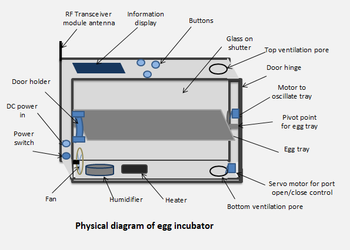
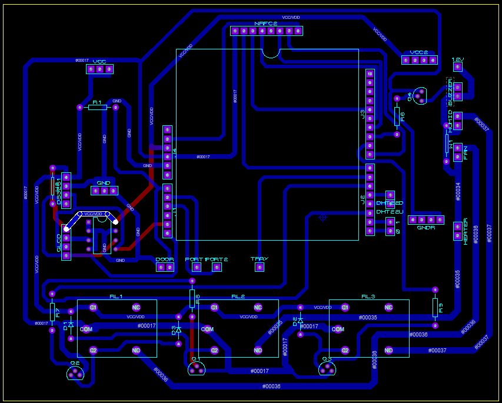
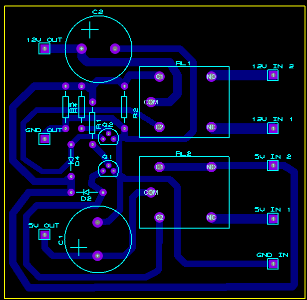
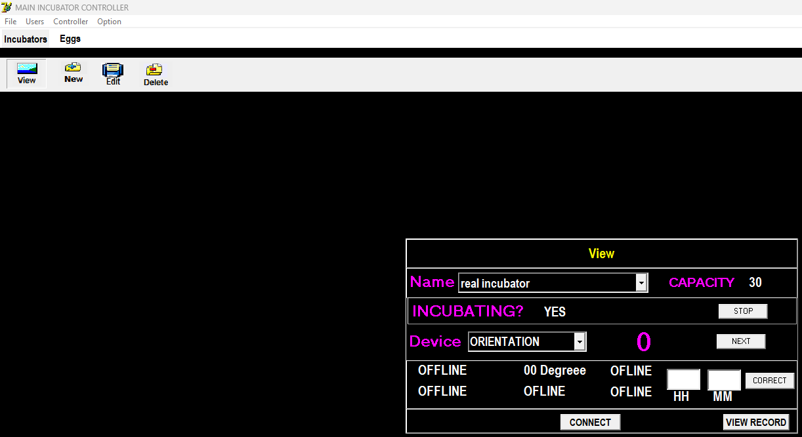
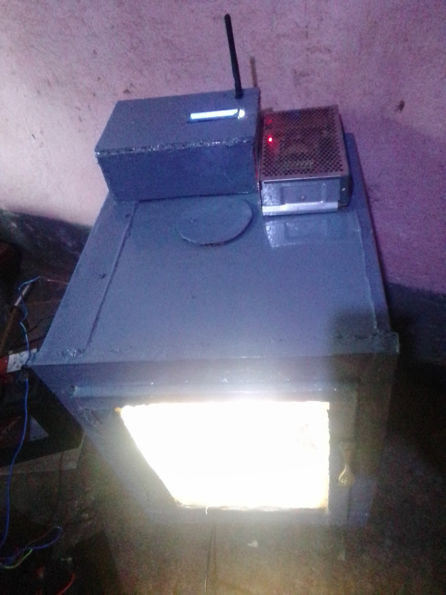
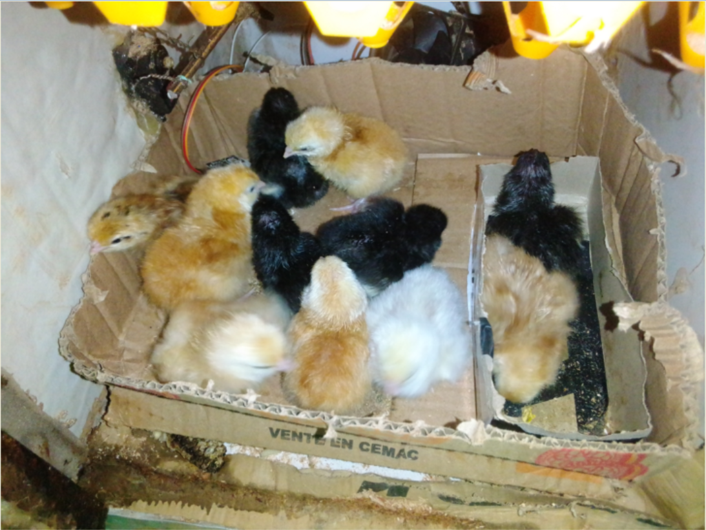
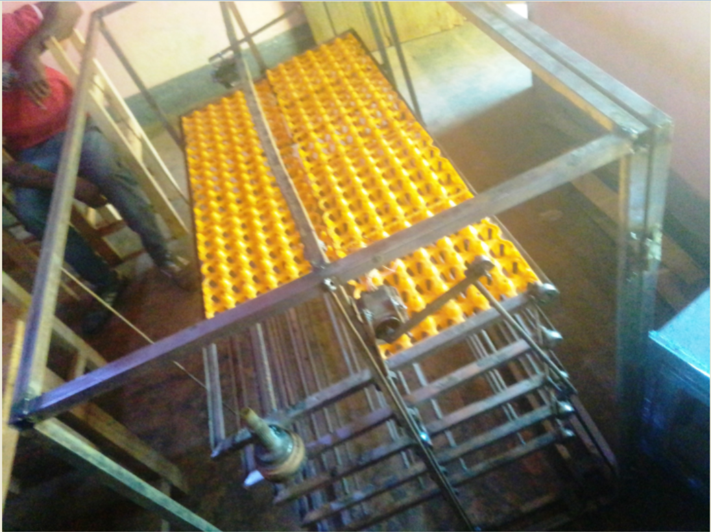
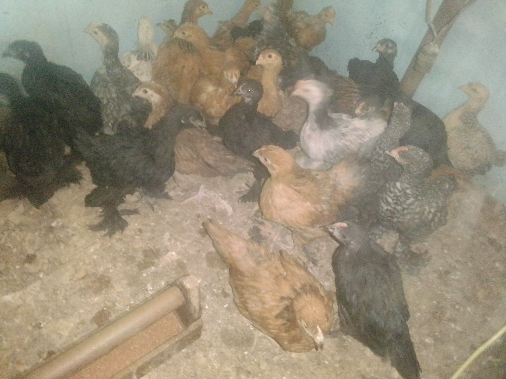

# IncubatorProject

## Overview
This repository documents my journey building a **poultry incubator system**, starting from a **30‑egg DC prototype** at the beginning of my Master’s program, and later expanding to a **1,200‑egg scaled system**.  
The project combines **embedded electronics, PCB design, sensor integration, and wireless communication** to solve real‑world challenges in poultry hatching. 

---

## Prototype: 30‑Egg DC System
- Designed a **DC‑based incubator** with a small internal changeover:
  - One supply charged the battery.
  - The other powered the system directly.
  - Battery takes over when mains is unavailable.
- Early issues:
  - PCB power traces burned out.
  - DHT22 sensor entered non‑responsive states.
  - NRF24L01 module missed signals, causing incomplete records.
- Debugging & fixes:
  - Reinforced PCB lines with cables.
  - Added a reliable DC‑DC converter.
  - Restored sensor and communication stability.
- Results:
  - Started with 25 eggs → 23 hatched.
  - 5 chicks died during growth → **18 healthy chicks sold**.
  - Collected real temperature/humidity data for analysis.

---
## Main view of incubator

## PCBs and interface

## 30 Eggs Incubator (tested with pantaloons (Brahma))

---

## Expansion: 1,200‑Egg System
- Scaled design to handle **industrial capacity**.
- Improved:
  - Power reliability.
  - Sensor stability.
  - Environmental control (temperature, humidity, airflow).
- Integrated monitoring and logging via **Delphi desktop app**.
- Tested with 50 eggs → **42 hatched successfully**.

---

## Hatch Results
From 30 Eggs incubator (pantaloons of Brahma)

---

## Technical Highlights
- **Microcontrollers**: Arduino platform.
- **Sensors**: DHT22 for temperature/humidity.
- **Wireless**: NRF24L01 for desktop communication.  
- **Software**: Delphi desktop app for monitoring and logging.  
- **PCB Tools**: Proteus, Arduino IDE.  

---

## Repository Contents
- `/Codes` → Arduino firmware, Delphi app, supporting scripts.  
- `/schematic and PCB` → PCB layouts, circuit diagrams, Proteus projects.  
- `/estimate` → Cost breakdown and project planning.  
- `/Images` → Photos of prototypes, scaled incubator, and hatch results.  

---

## Lessons Learned
- Difference between a **30‑minute prototype** and a **real‑life product**.  
- Importance of **resilience and debugging** in real conditions.  
- Engineering isn’t just schematics — it’s about solving problems and delivering results.  
- Current‑carrying abilities of different trace widths.  

---

## Initial application login
- **name**: che peter suh.
- **password**: pete3.

---
## License
This project is licensed under the [MIT License](LICENSE).
